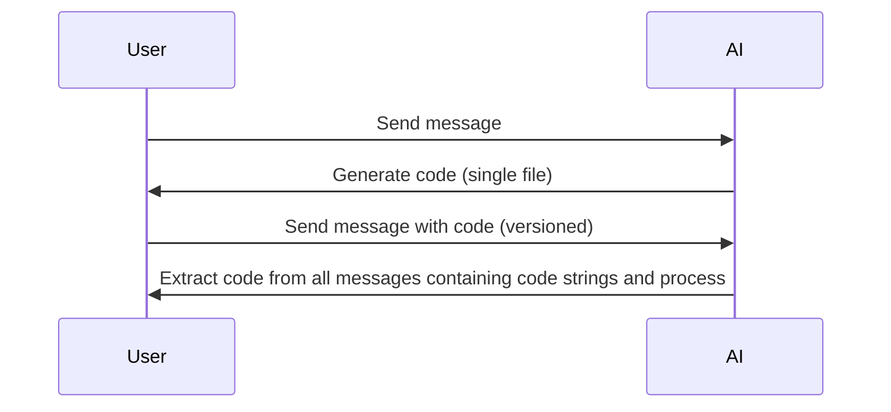
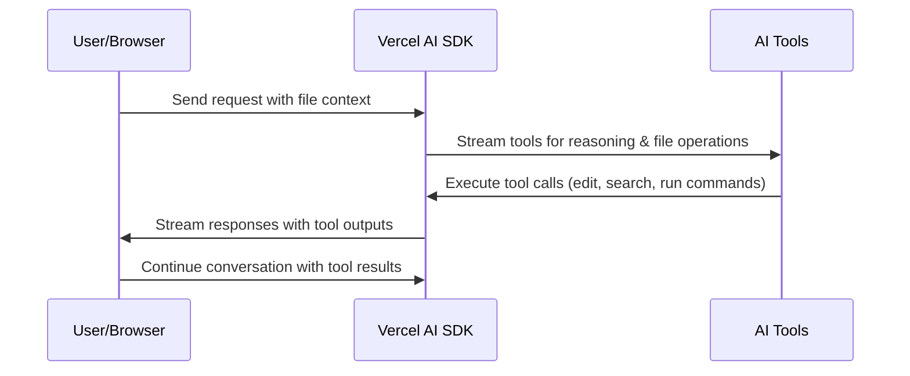
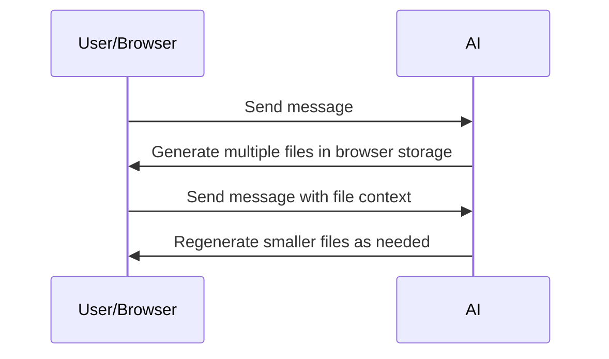
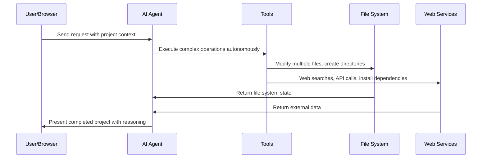

# Architecture Evolution

## Current Setup (Version 1)

_Message-based code generation with single-file output_

- Workflow: User request -> AI creates entire app.tsx -> Extract single code file from AI response
- User interactions via messages
- Code stored/extracted from message history
- Versioning through message chains

## Version 2: Vercel AI SDK Integration

_Vercel AI SDK with tool streaming and enhanced reasoning_

- Workflow: User request -> Vercel AI SDK streams tools -> Tools execute operations -> Stream results back
- Migrate from Together AI to Vercel AI SDK for better tool streaming
- Enhanced reasoning capabilities with tool calling
- Real-time streaming of AI thinking and tool execution
- Support for complex multi-step operations

## Version 3: Multi-File Project Support

_Client-side multi-file storage and editing_

- Workflow: User request -> AI creates multiple files -> Store in browser storage -> Regenerate smaller files as needed
- Migrate away from storing code in messages
- Project-based approach with client-side file storage
- Faster editing due to smaller, targeted file regeneration

## Version 4: Autonomous AI Agent

_Fully autonomous development with comprehensive tool access_

- Workflow: User request -> AI agent autonomously executes complex operations -> Full file system manipulation -> External integrations -> Deliver complete solution
- Fully autonomous AI agent with comprehensive tool access
- Complete project lifecycle management
- Advanced integrations: web APIs, package management, deployment
- Reasoning and planning across entire development workflow
