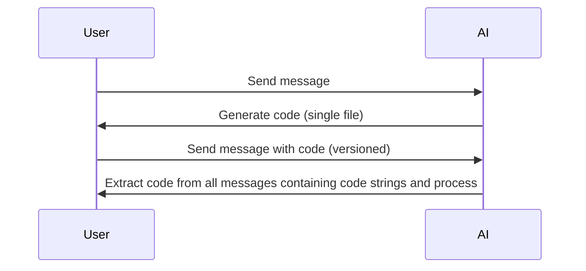
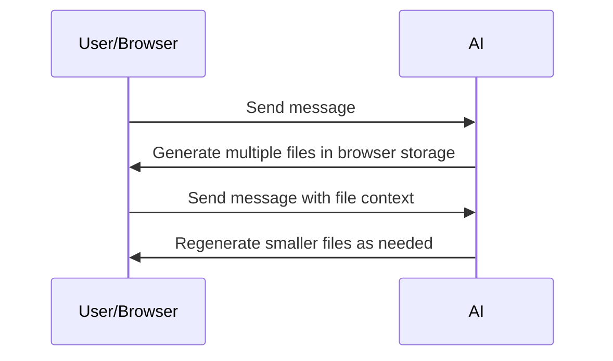
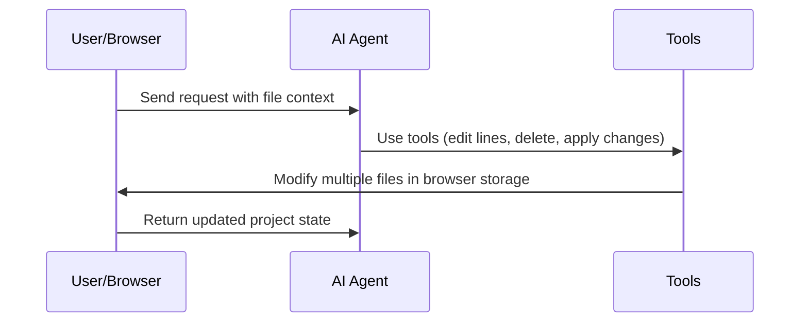

# Architecture Evolution

## Current Setup (Version 1)

- Workflow: User request -> AI creates entire app.tsx -> Extract single code file from AI response
- User interactions via messages
- Code stored/extracted from message history
- Versioning through message chains

## Intermediate Version (Version 2)

- Workflow: User request -> AI creates multiple files -> Store in browser storage -> Regenerate smaller files as needed
- Migrate away from storing code in messages
- Project-based approach with client-side file storage
- Faster editing due to smaller, targeted file regeneration

## Future Architecture (Version 3)

- Workflow: User request -> AI agent uses tools to edit lines, delete, apply changes -> Modify multiple files in browser -> Web searches, install dependencies -> Return updated project
- AI agent with full tool access
- Multiple file editing capabilities
- Advanced tools: line edits, deletions, web searches, dependency management
- Autonomous project manipulation
