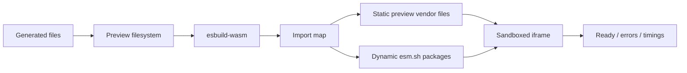

# Preview Renderer Migration

We migrated the preview off Sandpack because our generated apps are getting more modern than Sandpack can comfortably handle.

The renderer is browser-only at preview runtime: `esbuild-wasm` compiles the generated app files in the user's browser, import maps resolve our static preview substrate to prebuilt files in `/public/preview-vendor`, and any non-static allowed npm package falls back to pinned `esm.sh` URLs. The app then runs in our own sandboxed iframe.

## Why This Is Awesome

- Modern libraries work better: Recharts, Radix, framer-motion, `date-fns/locale`, CSS imports, and multi-file apps are all testable in one gauntlet.
- We control package versions instead of hoping Sandpack resolves compatible ones.
- We can see the real preview filesystem: generated files, injected shadcn files, `package.json`, and `import-map.json`.
- Errors come back through our own bridge, so “Try to fix” can send build/runtime/import errors back to the LLM.
- We get timing data: bundle time, runtime import/render time, and total time to ready.
- This same pipeline can power future benchmarks, screenshots, and app-quality evaluation.

## What Changed


```mermaid
flowchart LR
  A["Generated files"] --> B["Preview filesystem"]
  B --> C["esbuild-wasm"]
  C --> D["Import map"]
  D --> D1["Static preview vendor files"]
  D --> D2["Dynamic esm.sh packages"]
  D1 --> E["Sandboxed iframe"]
  D2 --> E
  E --> F["Ready / errors / timings"]
```

Generated code still writes normal imports:

```ts
import { motion } from "framer-motion";
import { Button } from "@/components/ui/button";
```

We decide what those resolve to:

```json
{
  "framer-motion": "11.15.0",
  "recharts": "3.9.1",
  "react": "19.1.0"
}
```

## Bottom Line

Sandpack was great for getting started. This is the grown-up renderer: clearer files, fresher dependencies, better errors, measurable performance, and a real path to dynamic dependency support later.
